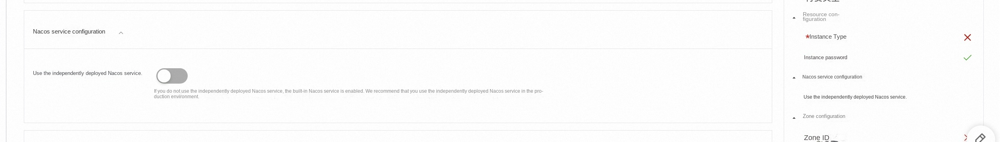
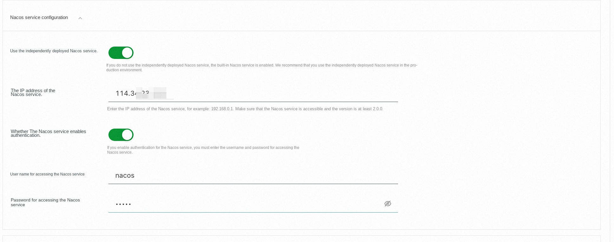
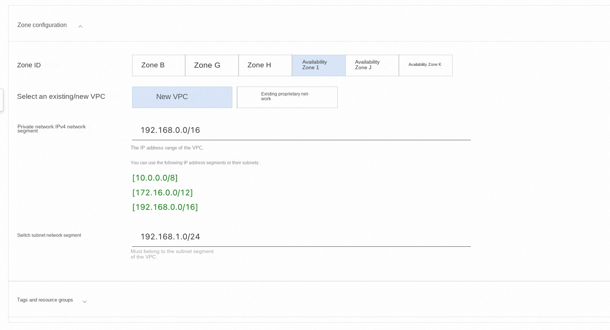
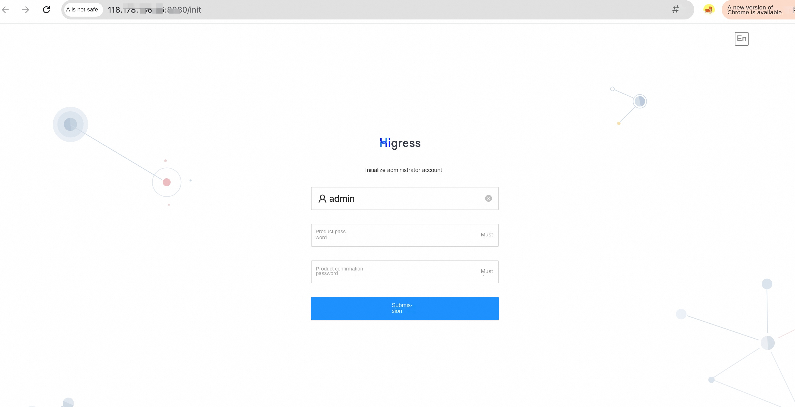

# Higress deployment documentation

## Overview

Higress is a cloud native API gateway. The kernel is based on Istio and Envoy. Wasm plug-ins can be written in Go, Rust, JS, etc. It provides dozens of ready-made general plug-ins and out-of-the-box console. Higress was born in Alibaba to solve the problem of Tengine reload on long-term connection business and insufficient gRPC/Dubbo load balancing capability. Alibaba Cloud has built a cloud-native API gateway product based on the Higress, providing 99.99 percent of the gateway high availability guarantee service capabilities for a large number of enterprise customers. Based on the AI gateway capability, the Higress supports AI services such as Tongyi Thousand Questions APP, Bailian Model API, and Machine Learning PAI Platform. AIGC companies that also serve the domestic head (e. g., all things), as well as AI products (e. g., FastGPT).

## Billing Description

Higress expenses on computing nests relate primarily:

The selected vCPU and memory specifications disk capacity public network bandwidth billing methods include:

-Pay-As-You-Go (hours)
-The estimated monthly fee can be seen in real time when the instance is created.

The estimated cost can be seen in real time when the instance is created.

## Deployment Architecture

Higress Community Edition is a stand-alone deployment architecture that is deployed independently based on the Docker Compose.

## Permissions required for RAM accounts

The One Api service needs to access and create resources such as ECS and VPC. If you use a RAM user to create a service instance, you need to add the corresponding resource permissions to the account of the RAM user before creating the service instance. For details about how to add RAM permissions, see Authorize RAM users. The required permissions are shown in the following table.

| Permission policy name | Comment |
| ------------------------------------- | ------------------------ |
| AliyunECSFullAccess | Permissions to manage ECS instances |
| AliyunVPCFullAccess | Permissions to manage a VPC |
| AliyunROSFullAccess | Manage permissions for Resource Orchestration Service (ROS) |
| AliyunComputeNestUserFullAccess | Manage user-side permissions for the compute nest service (ComputeNest) |
| AliyunCloudMonitorFullAccess | Permissions to manage CloudMonitor (CloudMonitor) |

## Deployment process

### Deployment steps

1. Click the deployment link to enter the service instance deployment page.
2. According to the interface prompt, fill in the parameters to complete the deployment.
Select a resource type and configure an ECS instance password.

Configure the Nacos service. If you do not have an independently deployed Nacos service, you can use the built-in Nacos service.

If the Nacos service is deployed independently, set the IP address of the Nacos service. If authentication is enabled for Nacos, enter the username and password.

Finally, configure the zone. You can create a new VPC or use an existing VPC.

3. After setting the parameters, click Next to confirm the order, click Create Now, and wait for the service instance to be created.
4. After the service instance is successfully created, go to the service instance details page. On the Overview page, you can obtain the login information of the Higress.

### Validation Results

Click on the link to enter the console of the Higress, and you can start using it after logging in according to the prompt.

<footer>

 View more computing nest services (https://computenest.aliyun.com)

</footer>

