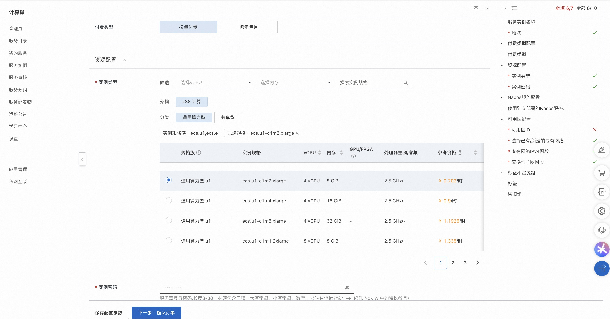
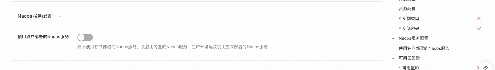
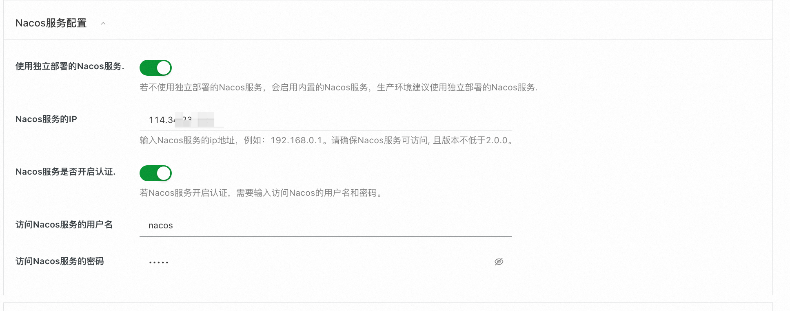
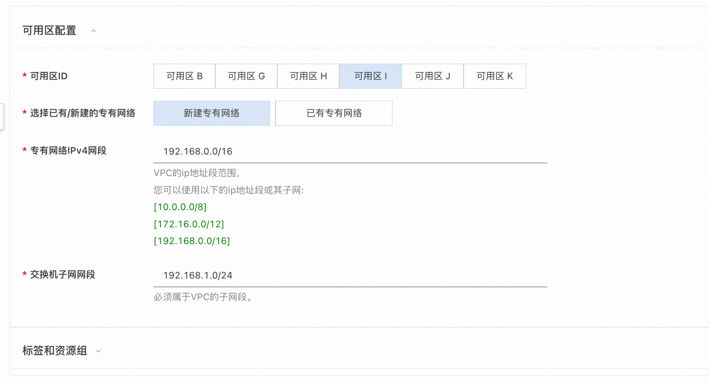
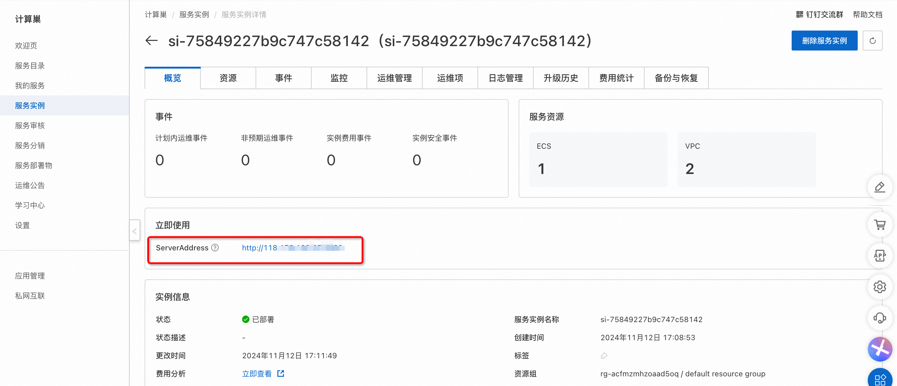
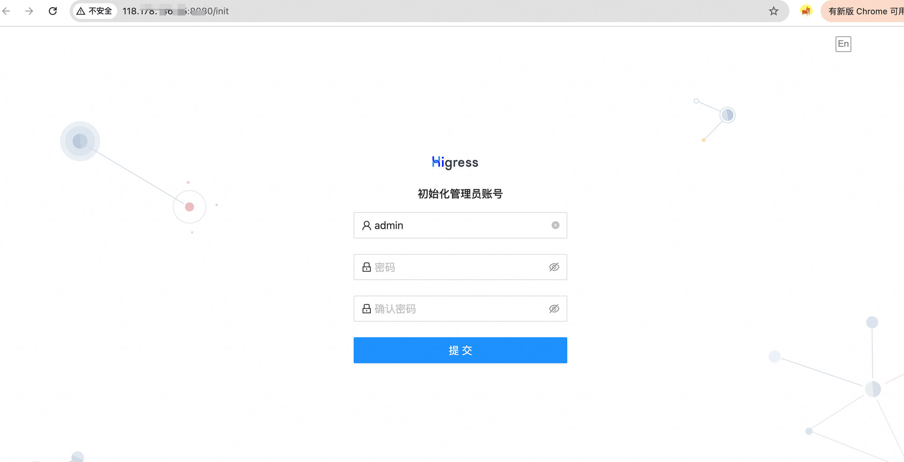

<h1>Higress deployment documentation </h1>

<h2> Overview </h2>

Higress is a cloud-native API gateway with a kernel based on Istio and Envoy. Wasm plug-ins can be written in Go/Rust/JS, etc., providing dozens of ready-made general plug-ins and out-of-the-box console. 

Higress was born in Ali to solve the problem of Tengine reload on long connection business and insufficient gRPC/Dubbo load balancing capability. 

 Alibaba Cloud has built a cloud-native API gateway product based on the Higress, providing 99.99 percent of the gateway high availability guarantee service capabilities for a large number of enterprise customers. 

 based on AI gateway capability, the Higress supports AI services such as tong yi qianwen APP, bailian big model API, machine learning PAI platform, etc. At the same time, it serves the domestic leading AIGC enterprises (such as zero and one things) and AI products (such as FastGPT)

<h2> Billing instructions </h2>

 The cost of the Higress in calculating the nest mainly involves:

 the selected vCPU and memory specifications disk capacity public network bandwidth billing methods include:

<ul>
<li> Pay-As-You-Go (hourly)</li>
<li> The estimated annual and monthly fees can be seen in real time when the instance is created. </li>
</ul>

 The estimated cost is visible in real time when the instance is created. 

<h2> Deployment Architecture </h2>

Higress Community Edition is a stand-alone deployment architecture, which is deployed independently based on the Docker Compose.

<h2> Permissions required for RAM accounts </h2>

One Api service needs to access and create resources such as ECS and VPC. If you use a RAM user to create a service instance, you need to add the corresponding resource permissions to the account of the RAM user before creating the service instance. For details about how to add RAM permissions, see Authorize RAM users. The required permissions are shown in the following table. 

<table>
<thead>
<tr>
<th> Permission policy name </th>
<th> Remarks </th>
</tr>
</thead>
<tbody>
<tr>
<td>AliyunECSFullAccess</td>
<td> Permissions to manage ECS </td>
</tr>
<tr>
<td>AliyunVPCFullAccess</td>
<td> Permissions for managing VPC networks </td>
</tr>
<tr>
<td>AliyunROSFullAccess</td>
<td> Manage permissions for Resource Orchestration Services (ROS) </td>
</tr>
<tr>
<td>AliyunComputeNestUserFullAccess</td>
<td> Manage user-side permissions for the compute nest service (ComputeNest) </td>
</tr>
<tr>
<td>AliyunCloudMonitorFullAccess</td>
<td> Permissions to manage CloudMonitor (CloudMonitor) </td>
</tr>
</tbody>
</table>

<h2> Deployment process </h2>

<h3> Deployment steps </h3>

<ol>
<li> Click the deployment link to enter the service instance deployment page. </li>
<li> according to the interface prompt, fill in the parameters to complete the deployment.
Select a resource type and configure an ECS instance password.

Configure the Nacos service. If you do not have an independently deployed Nacos service, you can use the built-in Nacos service.
2.png" />
If the Nacos service is deployed independently, set the IP address of the Nacos service. If authentication is enabled for Nacos, enter the username and password.
3.png" />
Finally, configure the zone. You can create a new VPC or use an existing VPC.
</li>
<li> After setting the parameters, click Next to confirm the order, click Create Now, and wait for the service instance to be created. </li>
<li> After the service instance is created, go to the service instance details page. On the Overview page, you can obtain the login information of the Higress.
</li>
</ol>

<h3> Verify Results </h3>

 Click on the link to enter the Higress's console, and you can start using it after logging in according to the prompts.

<footer>

 View more computing nest services (https://computenest.aliyun.com)

</footer>

