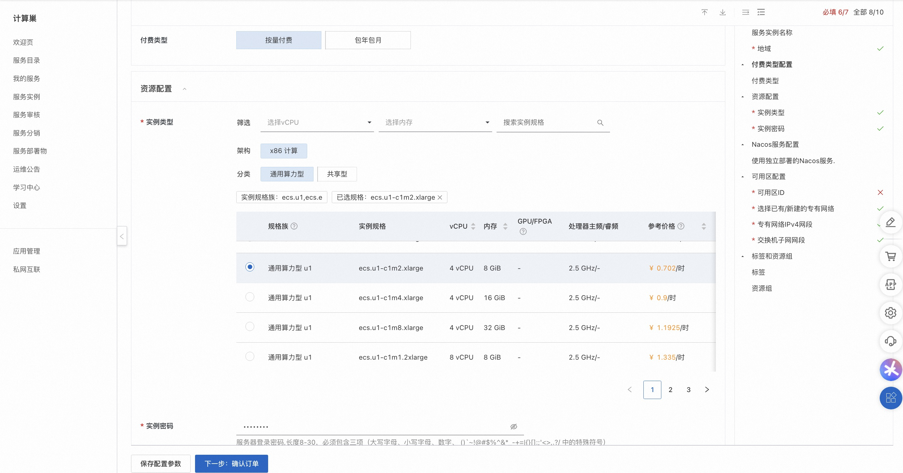
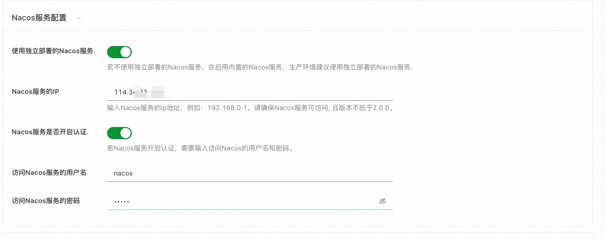
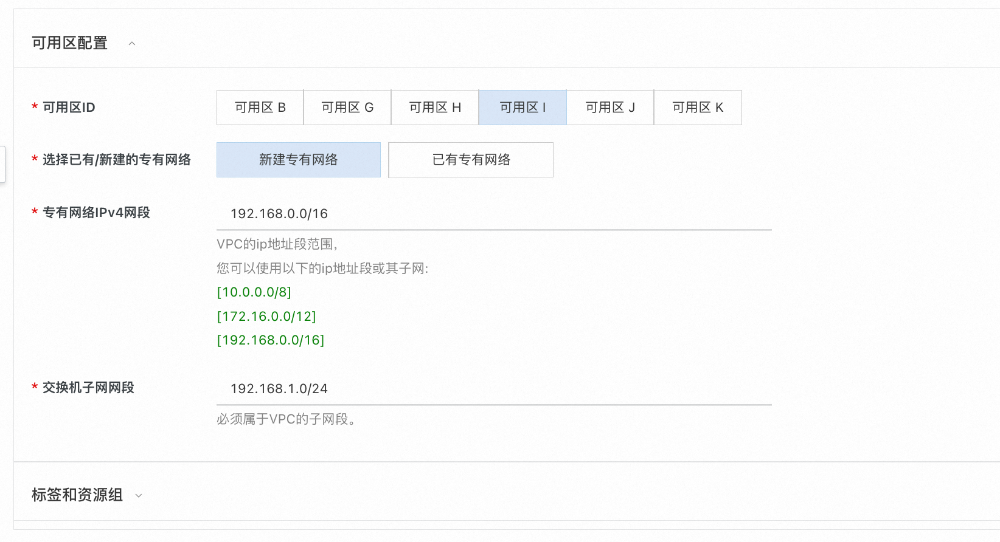
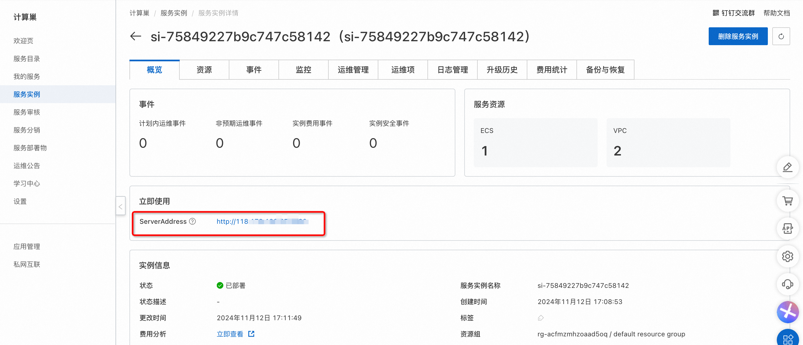

# Higress部署文档

## 概述

   Higress 是一款云原生 API 网关，内核基于 Istio 和 Envoy，可以用 Go/Rust/JS 等编写 Wasm 插件，提供了数十个现成的通用插件，以及开箱即用的控制台。Higress 在阿里内部为解决 Tengine reload 对长连接业务有损，以及 gRPC/Dubbo 负载均衡能力不足而诞生。阿里云基于 Higress 构建了云原生 API 网关产品，为大量企业客户提供 99.99% 的网关高可用保障服务能力。Higress 基于 AI 网关能力，支撑了通义千问 APP、百炼大模型 API、机器学习 PAI 平台等 AI 业务。同时服务国内头部的 AIGC 企业（如零一万物），以及 AI 产品（如 FastGPT）。

## 计费说明

Higress在计算巢上的费用主要涉及：

所选vCPU与内存规格 磁盘容量 公网带宽 计费方式包括：

- 按量付费（小时）
- 包年包月 预估费用在创建实例时可实时看到。

预估费用在创建实例时可实时看到。

## 部署架构

Higress社区版是单机部署架构, 基于 Docker Compose进行独立部署.

## RAM账号所需权限

One Api服务需要对ECS、VPC等资源进行访问和创建操作，若您使用RAM用户创建服务实例，需要在创建服务实例前，对使用的RAM用户的账号添加相应资源的权限。添加RAM权限的详细操作，请参见为RAM用户授权 。所需权限如下表所示。

| 权限策略名称                          | 备注                         |
|---------------------------------|----------------------------|
| AliyunECSFullAccess             | 管理云服务器服务（ECS）的权限           |
| AliyunVPCFullAccess             | 管理专有网络（VPC）的权限             |
| AliyunROSFullAccess             | 管理资源编排服务（ROS）的权限           |
| AliyunComputeNestUserFullAccess | 管理计算巢服务（ComputeNest）的用户侧权限 |
| AliyunCloudMonitorFullAccess    | 管理云监控（CloudMonitor）的权限     |

## 部署流程

### 部署步骤

1. 单击部署链接，进入服务实例部署界面。
2. 根据界面提示，填写参数完成部署。
   选择资源类型并配置ECS实例密码.
   
   配置Nacos服务，如果没有独立部署的Nacos服务，可以使用内置的Nacos服务，但不建议生产环境下使用。
   
   若有独立部署的Nacos服务，设置Nacos服务的Ip地址，如果Nacos开启了鉴权认证，则需要填写用户名和密码
   
   最后配置可用区，可选择新建VPC，也可使用已有的VPC.
   
3. 设置完参数后，点击下一步确认订单，点击立即创建，等待服务实例创建完成。
4. 服务实例创建成功后，进入服务实例详情页。在概览页可获取Higress的登录信息。
   

### 验证结果

 点击链接可进入Higress的控制台，根据提示登录之后即可开始使用。
 

    <footer>
        
查看更多计算巢服务(https://computenest.aliyun.com)

    </footer>

